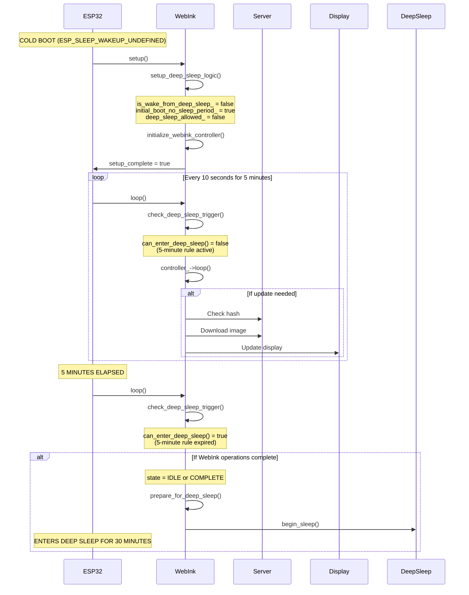
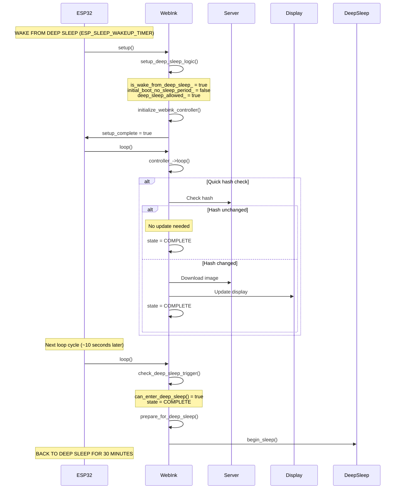
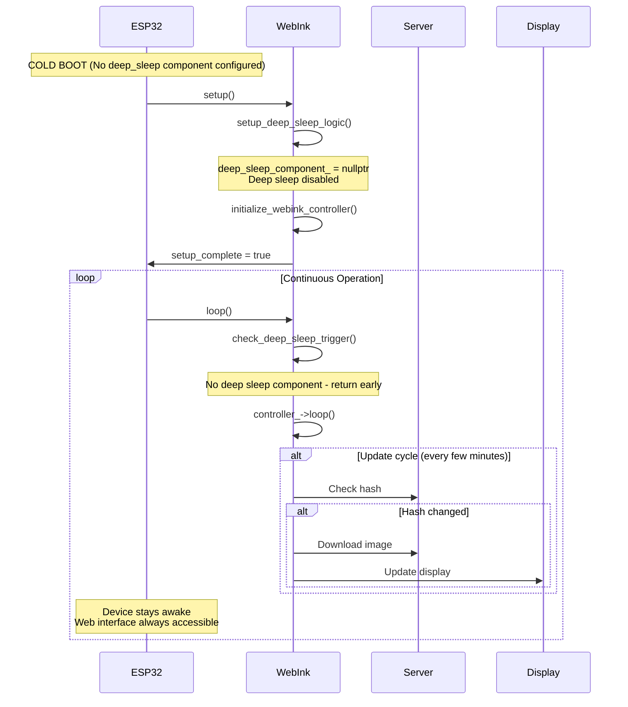
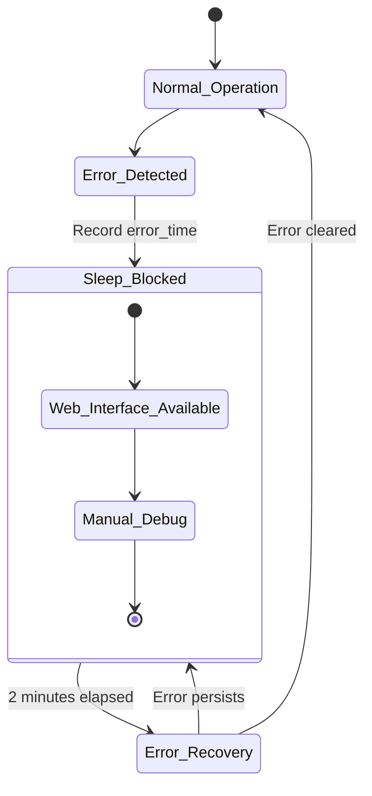

# WebInk Component Lifecycle Documentation

## Overview

This document provides a comprehensive analysis of the WebInk ESPHome component lifecycle, covering both deep sleep enabled and disabled scenarios. The WebInk component manages e-ink display updates through a sophisticated state machine that handles power management, error recovery, and reliable operation.

## Table of Contents

1. [Component Architecture](#component-architecture)
2. [Deep Sleep vs Regular Operation](#deep-sleep-vs-regular-operation)
3. [Boot Detection Logic](#boot-detection-logic)
4. [Detailed Lifecycle Flows](#detailed-lifecycle-flows)
5. [Error Handling and Recovery](#error-handling-and-recovery)
6. [Configuration Reference](#configuration-reference)
7. [Troubleshooting Guide](#troubleshooting-guide)

---

## Component Architecture

### Core Components

```
┌─────────────────────────────────────────────────────────────────┐
│                    WebInkESPHomeComponent                       │
│  ┌─────────────────┐  ┌─────────────────┐  ┌─────────────────┐  │
│  │   Deep Sleep    │  │  WebInk Core    │  │   ESPHome       │  │
│  │     Logic       │  │   Controller    │  │  Integration    │  │
│  │                 │  │                 │  │                 │  │
│  │ • Boot detect   │  │ • State machine │  │ • Display mgr   │  │
│  │ • Timer rules   │  │ • Network ops   │  │ • WiFi status   │  │
│  │ • Error blocks  │  │ • Image proc    │  │ • Component     │  │
│  │ • Sleep trigger │  │ • Memory mgmt   │  │   lifecycle     │  │
│  └─────────────────┘  └─────────────────┘  └─────────────────┘  │
└─────────────────────────────────────────────────────────────────┘
```

### State Machine States

- **`IDLE`** - Waiting for next update cycle
- **`CONNECTING`** - Establishing network connection
- **`CHECKING_HASH`** - Verifying if display update needed
- **`DOWNLOADING_IMAGE`** - Fetching new image data
- **`PROCESSING_IMAGE`** - Parsing and optimizing image
- **`UPDATING_DISPLAY`** - Writing to e-ink display
- **`COMPLETE`** - Update finished successfully
- **`ERROR`** - Operation failed, needs recovery

---

## Deep Sleep vs Regular Operation

### Deep Sleep Enabled Configuration

**ESPHome YAML:**
```yaml
deep_sleep:
  id: deep_sleep_1
  sleep_duration: 30min
  wakeup_pin: GPIO0  # Optional button wake

webink:
  # ... other config ...
  deep_sleep_component: deep_sleep_1
```

**Power Characteristics:**
- Sleep current: ~10μA
- Active current: ~100-200mA
- Battery life: Months to years
- Update frequency: Every 30 minutes

**Accessibility:**
- Web interface: Only during 5-minute boot window or errors
- OTA updates: Only during 5-minute boot window
- Debugging: Limited to wake cycles

### Regular Operation Configuration

**ESPHome YAML:**
```yaml
# No deep_sleep component configured

webink:
  # ... other config ...
  # deep_sleep_component not specified
```

**Power Characteristics:**
- Continuous current: ~100-200mA
- Battery life: Days to weeks
- Update frequency: Every few minutes

**Accessibility:**
- Web interface: Always available
- OTA updates: Always available
- Debugging: Full access to logs and metrics

---

## Boot Detection Logic

### ESP32 Wakeup Cause Detection

The component uses `esp_sleep_get_wakeup_cause()` to determine boot type:

```cpp
esp_sleep_wakeup_cause_t wakeup_reason = esp_sleep_get_wakeup_cause();

switch (wakeup_reason) {
    case ESP_SLEEP_WAKEUP_TIMER:      // Scheduled wake
    case ESP_SLEEP_WAKEUP_GPIO:       // Button wake  
    case ESP_SLEEP_WAKEUP_TOUCHPAD:   // Touch wake
    case ESP_SLEEP_WAKEUP_ULP:        // ULP wake
        // This is a wake from deep sleep
        is_wake_from_deep_sleep_ = true;
        initial_boot_no_sleep_period_ = false;  // Skip 5-minute rule
        break;
        
    case ESP_SLEEP_WAKEUP_UNDEFINED:  // Cold boot
    default:
        // This is a fresh boot
        is_wake_from_deep_sleep_ = false;
        initial_boot_no_sleep_period_ = true;   // Enforce 5-minute rule
        break;
}
```

### Boot Type Implications

| Boot Type | 5-Min Rule | Deep Sleep Available | Use Case |
|-----------|------------|---------------------|----------|
| **Cold Boot** | ✅ Enforced | ❌ After 5 minutes | Firmware update, debugging |
| **Wake from Sleep** | ❌ Skipped | ✅ Immediately | Normal operation |

---

## Detailed Lifecycle Flows

### Cold Boot with Deep Sleep Enabled



### Wake from Deep Sleep



### Regular Operation (No Deep Sleep)



---

## Error Handling and Recovery

### Error Types and Sleep Blocking

| Error Scenario | Sleep Block Duration | Recovery Method |
|----------------|---------------------|-----------------|
| **Network timeout** | 2 minutes | Automatic retry |
| **Server error (4xx/5xx)** | 2 minutes | Server fix needed |
| **Image parsing failure** | 2 minutes | Automatic retry |
| **Display update failure** | 2 minutes | Hardware check |
| **WiFi disconnection** | No block* | Automatic reconnect |

*WiFi disconnection doesn't block sleep as the device will reconnect on wake.

### Error State Flow



### Deep Sleep Safety Checks

The `can_enter_deep_sleep()` method performs comprehensive safety checks:

```cpp
bool can_enter_deep_sleep() const {
    // 1. Component initialization check
    if (!setup_complete_ || !controller_) return false;
    
    // 2. Initial boot 5-minute rule (cold boot only)
    if (initial_boot_no_sleep_period_ && 
        (millis() - initial_boot_time_) < 5*60*1000) return false;
    
    // 3. Recent error check (any boot type)
    if (last_error_time_ > 0 && 
        (millis() - last_error_time_) < 2*60*1000) return false;
    
    // 4. Active operations check
    UpdateState state = controller_->get_current_state();
    if (state == CONNECTING || state == DOWNLOADING_IMAGE || /* etc */) return false;
    
    // 5. Error state check
    if (state == ERROR) {
        last_error_time_ = millis();  // Block sleep
        return false;
    }
    
    return true;  // All checks passed
}
```

---

## Configuration Reference

### ESPHome YAML Configuration

```yaml
# Deep Sleep Enabled Configuration
deep_sleep:
  id: deep_sleep_1
  sleep_duration: 30min
  wakeup_pin: GPIO0  # Optional - allows manual wake

webink:
  server_url: "http://your-server.com:8000"
  device_id: "living-room-display"
  api_key: "your-api-key"
  display_mode: "800x480x1xB"
  socket_port: 8001
  rows_per_slice: 7
  deep_sleep_component: deep_sleep_1  # Links to deep sleep
  display: waveshare_epd
  
# Regular Operation Configuration  
webink:
  server_url: "http://your-server.com:8000"
  device_id: "living-room-display"
  api_key: "your-api-key"
  display_mode: "800x480x1xB"
  socket_port: 8001
  rows_per_slice: 7
  # No deep_sleep_component specified
  display: waveshare_epd
```

### Component Parameters

| Parameter | Type | Default | Description |
|-----------|------|---------|-------------|
| `server_url` | string | Required | WebInk server URL |
| `device_id` | string | Required | Unique device identifier |
| `api_key` | string | Required | Server authentication key |
| `display_mode` | string | Required | Format: "800x480x1xB" |
| `socket_port` | int | 8001 | TCP socket port for low-power mode |
| `rows_per_slice` | int | 7 | Memory optimization parameter |
| `deep_sleep_component` | id | Optional | Links to ESPHome deep_sleep component |
| `display` | id | Required | ESPHome display component |

---

## Troubleshooting Guide

### Common Issues

#### 1. Device Never Enters Deep Sleep

**Symptoms:**
- High power consumption
- Device always accessible via web interface
- Logs show "Deep sleep state changed: ALLOWED -> BLOCKED"

**Causes & Solutions:**
```
✓ Check ESPHome YAML has deep_sleep component configured
✓ Verify deep_sleep_component parameter links correctly
✓ Wait 5 minutes after cold boot before expecting sleep
✓ Check for ongoing errors preventing sleep
✓ Ensure WebInk operations complete (state = IDLE/COMPLETE)
```

#### 2. Device Sleeps Too Early

**Symptoms:**
- Cannot access web interface for updates
- Device sleeps before completing first update

**Causes & Solutions:**
```
✓ This should not happen - 5-minute rule prevents early sleep
✓ Check if device is waking from deep sleep (not cold boot)
✓ Verify is_wake_from_deep_sleep_ logic is correct
✓ Check boot reason detection in logs
```

#### 3. Device Never Wakes from Deep Sleep

**Symptoms:**
- Device unresponsive after entering sleep
- No network activity after expected wake time

**Causes & Solutions:**
```
✓ Check ESP32 hardware - some boards have deep sleep issues
✓ Verify ESPHome deep_sleep configuration
✓ Test with shorter sleep duration (5min) for debugging
✓ Add wakeup_pin for manual wake capability
✓ Check power supply stability
```

#### 4. Frequent Error States

**Symptoms:**
- Device never sleeps due to 2-minute error blocks
- Continuous error/recovery cycles

**Causes & Solutions:**
```
✓ Check WebInk server accessibility
✓ Verify network connectivity and DNS
✓ Check server logs for API errors
✓ Verify display_mode matches server configuration
✓ Test with curl: curl "http://server:8000/get_hash?api_key=..."
```

### Debug Logging

Enable verbose logging in ESPHome YAML:

```yaml
logger:
  level: DEBUG
  logs:
    webink: DEBUG
    webink.network: DEBUG
    webink.config: DEBUG
    webink.state: DEBUG
```

### Key Log Messages

**Normal Deep Sleep Flow:**
```
[I] WebInk controller initialized with server: http://...
[I] Cold boot detected - 5-minute no-sleep period active
[I] Deep sleep setup: wake=false, no_sleep_period=true, allowed=false
[I] Deep sleep state changed: BLOCKED -> ALLOWED
[I] WebInk operations complete - entering deep sleep for 30 minutes
[I] Preparing for deep sleep...
[I] Ready for deep sleep
```

**Wake from Deep Sleep Flow:**
```
[I] Woke from deep sleep (cause: 1)
[I] Deep sleep setup: wake=true, no_sleep_period=false, allowed=true
[I] WebInk operations complete - entering deep sleep for 30 minutes
```

**Error Recovery Flow:**
```
[W] HTTP request failed: timeout
[I] Deep sleep state changed: ALLOWED -> BLOCKED
[I] Deep sleep state changed: BLOCKED -> ALLOWED  # After 2 minutes
```

---

## Component Integration Examples

### Basic Deep Sleep Setup

```yaml
# ESPHome configuration for battery-powered e-ink display
esphome:
  name: webink-display
  platform: ESP32
  board: esp32dev

wifi:
  ssid: "YourWiFi"
  password: "YourPassword"

deep_sleep:
  id: sleep_component
  sleep_duration: 30min
  wakeup_pin: GPIO0

display:
  - platform: waveshare_epd
    id: epd_display
    model: 7.50in-v2
    cs_pin: GPIO15
    dc_pin: GPIO27
    busy_pin: GPIO25
    reset_pin: GPIO26

webink:
  server_url: "http://webink-server.local:8000"
  device_id: "kitchen-display"
  api_key: "secure-api-key-here"
  display_mode: "800x480x1xB"
  deep_sleep_component: sleep_component
  display: epd_display
```

### Development/Testing Setup

```yaml
# ESPHome configuration for development (no deep sleep)
esphome:
  name: webink-dev
  platform: ESP32
  board: esp32dev

wifi:
  ssid: "YourWiFi"
  password: "YourPassword"

# No deep_sleep component for development

display:
  - platform: waveshare_epd
    id: epd_display
    model: 7.50in-v2
    cs_pin: GPIO15
    dc_pin: GPIO27
    busy_pin: GPIO25
    reset_pin: GPIO26

webink:
  server_url: "http://192.168.1.100:8000"
  device_id: "dev-display"
  api_key: "dev-api-key"
  display_mode: "800x480x1xB"
  display: epd_display
  # No deep_sleep_component specified - stays awake
```

This completes the comprehensive WebInk component lifecycle documentation. The system is designed for reliable operation in both battery-powered (deep sleep) and continuously-powered scenarios, with robust error handling and recovery mechanisms.
